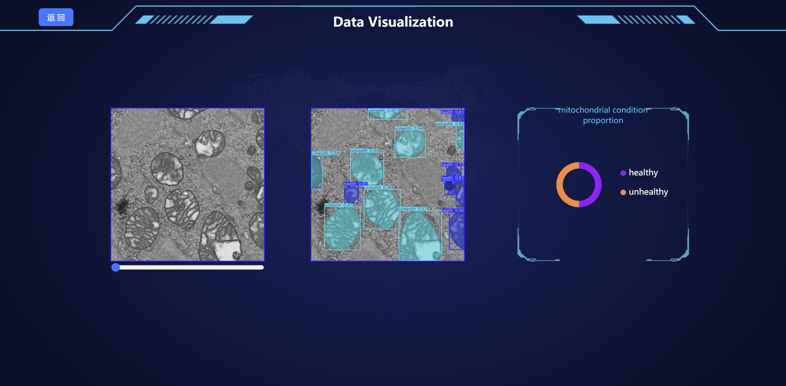
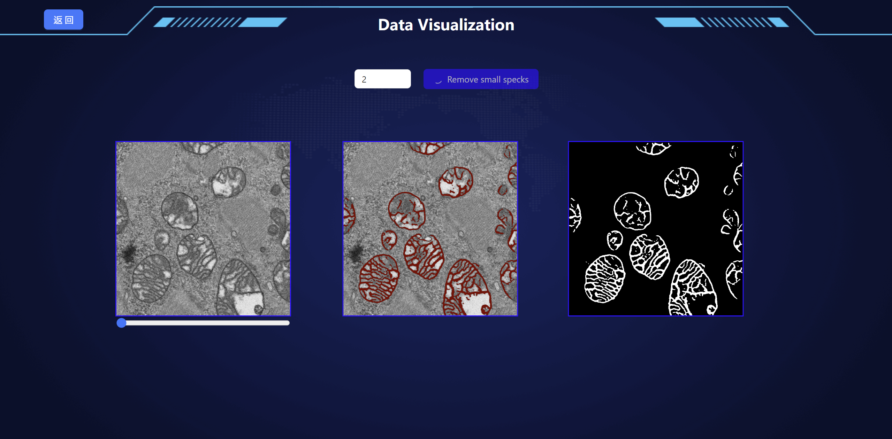
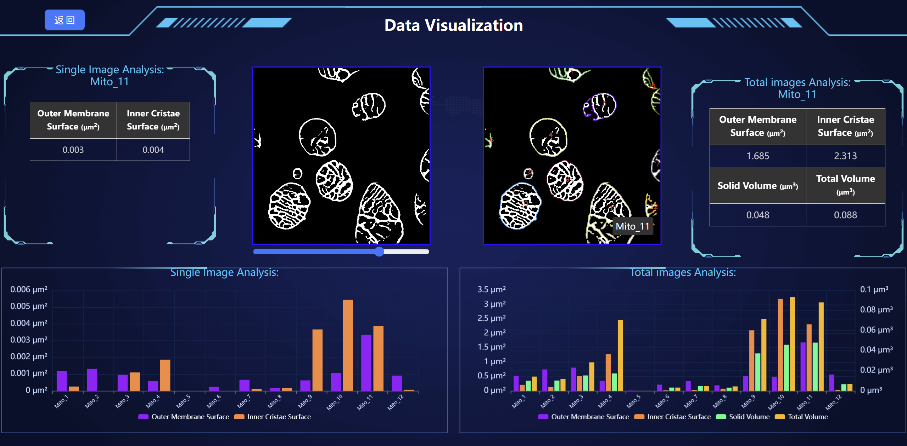

# Segmentation 

## :book:Table Of Contents

- [Update](#update)
- [Installation](#installation)
- [Dataset](#segmentation_data)
- [Pretrained Models](#pretrained_models)
- [GUI](#Usage)
- [Inference](#inference)
- [visualization](#visualization)
- [Citation](#Citation)

## <a name="update"></a>:new:Update

- **2024.08.30**: This repo is released.

## <a name="installation"></a>:gear:Installation

```shell
# clone this repo
git clone https://github.com/xiaohuawan/MitoStructSeg.git
cd MitoStructSeg

# create environment
conda create -n MitoStructSeg python=3.9.19
conda activate MitoStructSeg
pip install -r requirements.txt
```

## <a name="segmentation_data"></a>ℹ️Dataset

<table class="table-auto w-full border-collapse">
  <!-- 表头 -->
  <thead>
    <tr class="bg-gray-100">
      <th class="border px-4 py-2 text-left font-bold">Dataset</th>
      <th class="border px-4 py-2 text-left font-bold">Dataset Name</th>
      <th colspan="2" class="border px-4 py-2 text-center font-bold">Source Domain</th>
      <th colspan="2" class="border px-4 py-2 text-center font-bold">Target Domain</th>
      <th colspan="2" class="border px-4 py-2 text-center font-bold">Validation</th>
    </tr>
    <tr class="bg-gray-100">
      <th class="border px-4 py-2 text-left font-bold"></th>
      <th class="border px-4 py-2 text-left font-bold"></th>
      <th class="border px-4 py-2 text-center font-bold">Quark Cloud Disk</th>
      <th class="border px-4 py-2 text-center font-bold">Google Cloud Disk</th>
      <th class="border px-4 py-2 text-center font-bold">Quark Cloud Disk</th>
      <th class="border px-4 py-2 text-center font-bold">Google Cloud Disk</th>
      <th class="border px-4 py-2 text-center font-bold">Quark Cloud Disk</th>
      <th class="border px-4 py-2 text-center font-bold">Google Cloud Disk</th>
    </tr>
  </thead>
  <!-- 表格内容 -->
  <tbody>
    <!-- 病人的心肌细胞线粒体 -->
    <tr>
      <th rowspan="3" class="border px-4 py-2 bg-blue-50 font-bold text-center">Human Myocardium Dataset</th>
      <td class="border px-4 py-2 font-bold">Patient#1</td>
      <td class="border px-4 py-2 text-center"><a href="https://pan.quark.cn/s/dcb88aa73c49?pwd=84J2" target="_blank" class="inline-flex items-center px-3 py-1 bg-blue-600 text-white rounded hover:bg-blue-700 transition"><i class="fa fa-download mr-2"></i>Download</a></td>
      <td class="border px-4 py-2 text-center"><a href="https://drive.google.com/drive/folders/1FUkabspbYWQMlD52IzZ0C-uhBRZG4hSL?usp=drive_link" target="_blank" class="inline-flex items-center px-3 py-1 bg-red-600 text-white rounded hover:bg-red-700 transition"><i class="fa fa-download mr-2"></i>Download</a></td>
      <td class="border px-4 py-2 text-center"><a href="https://pan.quark.cn/s/056b849eb0c2?pwd=8Thb" target="_blank" class="inline-flex items-center px-3 py-1 bg-blue-600 text-white rounded hover:bg-blue-700 transition"><i class="fa fa-download mr-2"></i>Download</a></td>
      <td class="border px-4 py-2 text-center"><a href="https://drive.google.com/drive/folders/1q8lXrCagIiYcnAtMvyDSIelYxjEIcKsU?usp=drive_link" target="_blank" class="inline-flex items-center px-3 py-1 bg-red-600 text-white rounded hover:bg-red-700 transition"><i class="fa fa-download mr-2"></i>Download</a></td>
      <td class="border px-4 py-2 text-center"><a href="https://pan.quark.cn/s/60d56940b661?pwd=yZDD" target="_blank" class="inline-flex items-center px-3 py-1 bg-blue-600 text-white rounded hover:bg-blue-700 transition"><i class="fa fa-download mr-2"></i>Download</a></td>
      <td class="border px-4 py-2 text-center"><a href="https://drive.google.com/drive/folders/1OzDbBzn7qHXn6-2BcuHs3CnWWUdwscFL?usp=drive_link" target="_blank" class="inline-flex items-center px-3 py-1 bg-red-600 text-white rounded hover:bg-red-700 transition"><i class="fa fa-download mr-2"></i>Download</a></td>
    </tr>
    <tr>
      <td class="border px-4 py-2 font-bold">Patient#2</td>
      <td class="border px-4 py-2 text-center"><a href="https://pan.quark.cn/s/dcb88aa73c49?pwd=84J2" target="_blank" class="inline-flex items-center px-3 py-1 bg-blue-600 text-white rounded hover:bg-blue-700 transition"><i class="fa fa-download mr-2"></i>Download</a></td>
      <td class="border px-4 py-2 text-center"><a href="https://drive.google.com/drive/folders/1FUkabspbYWQMlD52IzZ0C-uhBRZG4hSL?usp=drive_link" target="_blank" class="inline-flex items-center px-3 py-1 bg-red-600 text-white rounded hover:bg-red-700 transition"><i class="fa fa-download mr-2"></i>Download</a></td>
      <td class="border px-4 py-2 text-center"><a href="https://pan.quark.cn/s/312f08d717b8?pwd=kpUc" target="_blank" class="inline-flex items-center px-3 py-1 bg-blue-600 text-white rounded hover:bg-blue-700 transition"><i class="fa fa-download mr-2"></i>Download</a></td>
      <td class="border px-4 py-2 text-center"><a href="https://drive.google.com/drive/folders/17nScKn5o4Ms5DQdcdUjPjSgesCkkADtN?usp=drive_link" target="_blank" class="inline-flex items-center px-3 py-1 bg-red-600 text-white rounded hover:bg-red-700 transition"><i class="fa fa-download mr-2"></i>Download</a></td>
      <td class="border px-4 py-2 text-center"><a href="https://pan.quark.cn/s/419da953dd64?pwd=1ZyX" target="_blank" class="inline-flex items-center px-3 py-1 bg-blue-600 text-white rounded hover:bg-blue-700 transition"><i class="fa fa-download mr-2"></i>Download</a></td>
      <td class="border px-4 py-2 text-center"><a href="https://drive.google.com/drive/folders/12v9CG1N-dlobQof0-f4uHyOSF88OUsP9?usp=drive_link" target="_blank" class="inline-flex items-center px-3 py-1 bg-red-600 text-white rounded hover:bg-red-700 transition"><i class="fa fa-download mr-2"></i>Download</a></td>
    </tr>
    <tr>
      <td class="border px-4 py-2 font-bold">Patient#3</td>
      <td class="border px-4 py-2 text-center"><a href="https://pan.quark.cn/s/dcb88aa73c49?pwd=84J2" target="_blank" class="inline-flex items-center px-3 py-1 bg-blue-600 text-white rounded hover:bg-blue-700 transition"><i class="fa fa-download mr-2"></i>Download</a></td>
      <td class="border px-4 py-2 text-center"><a href="https://drive.google.com/drive/folders/1FUkabspbYWQMlD52IzZ0C-uhBRZG4hSL?usp=drive_link" target="_blank" class="inline-flex items-center px-3 py-1 bg-red-600 text-white rounded hover:bg-red-700 transition"><i class="fa fa-download mr-2"></i>Download</a></td>
      <td class="border px-4 py-2 text-center"><a href="https://pan.quark.cn/s/60d56940b661?pwd=yZDD" target="_blank" class="inline-flex items-center px-3 py-1 bg-blue-600 text-white rounded hover:bg-blue-700 transition"><i class="fa fa-download mr-2"></i>Download</a></td>
      <td class="border px-4 py-2 text-center"><a href="https://drive.google.com/drive/folders/1-2TIn_4RRyykjpnEZgCk68FLQCSzYt0V?usp=drive_link" target="_blank" class="inline-flex items-center px-3 py-1 bg-red-600 text-white rounded hover:bg-red-700 transition"><i class="fa fa-download mr-2"></i>Download</a></td>
      <td class="border px-4 py-2 text-center"><a href="https://pan.quark.cn/s/128e56a52b63?pwd=vAsu" target="_blank" class="inline-flex items-center px-3 py-1 bg-blue-600 text-white rounded hover:bg-blue-700 transition"><i class="fa fa-download mr-2"></i>Download</a></td>
      <td class="border px-4 py-2 text-center"><a href="https://drive.google.com/drive/folders/1C44ypskqb6VplI2CyG9DxQbPBs5ZjQc6?usp=drive_link" target="_blank" class="inline-flex items-center px-3 py-1 bg-red-600 text-white rounded hover:bg-red-700 transition"><i class="fa fa-download mr-2"></i>Download</a></td>
    </tr>
    <!-- 分隔线 -->
    <tr>
      <td colspan="8" class="border-t-2 border-gray-300"></td>
    </tr>
    <!-- 小鼠的线粒体 -->
    <tr>
      <th rowspan="2" class="border px-4 py-2 bg-green-50 font-bold text-center">Mouse Kidney Dataset</th>
      <td rowspan="2" class="border px-4 py-2 font-bold">Mouse Kidney</td>
      <td class="border px-4 py-2 text-center"><a href="https://pan.quark.cn/s/936686812cd3?pwd=4Apx" target="_blank" class="inline-flex items-center px-3 py-1 bg-blue-600 text-white rounded hover:bg-blue-700 transition"><i class="fa fa-download mr-2"></i>Download</a></td>
      <td class="border px-4 py-2 text-center"><a href="https://drive.google.com/drive/folders/1vJkPMhCcefSfWCx_zbuTHxyiFi8GIbuw?usp=drive_link" target="_blank" class="inline-flex items-center px-3 py-1 bg-red-600 text-white rounded hover:bg-red-700 transition"><i class="fa fa-download mr-2"></i>Download</a></td>
      <td class="border px-4 py-2 text-center"><a href="https://pan.quark.cn/s/c224765868e6?pwd=H6Kq" target="_blank" class="inline-flex items-center px-3 py-1 bg-blue-600 text-white rounded hover:bg-blue-700 transition"><i class="fa fa-download mr-2"></i>Download</a></td>
      <td class="border px-4 py-2 text-center"><a href="https://drive.google.com/drive/folders/1KMhgTbYsC79zKuP0AMqGqcHWDXw9pvEi?usp=drive_link" target="_blank" class="inline-flex items-center px-3 py-1 bg-red-600 text-white rounded hover:bg-red-700 transition"><i class="fa fa-download mr-2"></i>Download</a></td>
      <td class="border px-4 py-2 text-center"><a href="https://pan.quark.cn/s/2e1b809916f8?pwd=TgmZ" target="_blank" class="inline-flex items-center px-3 py-1 bg-blue-600 text-white rounded hover:bg-blue-700 transition"><i class="fa fa-download mr-2"></i>Download</a></td>
      <td class="border px-4 py-2 text-center"><a href="https://drive.google.com/drive/folders/1a94VNx0lLUF27ZeWfG50QqixQ-6ltswk?usp=drive_link" target="_blank" class="inline-flex items-center px-3 py-1 bg-red-600 text-white rounded hover:bg-red-700 transition"><i class="fa fa-download mr-2"></i>Download</a></td>
    </tr>
  </tbody>
</table>


## <a name="pretrained_models"></a>:dna:Pretrained Models

| Model Name | Description |  Quark Cloud Disk | Google Cloud Disk |  
| :---------: | :----------: | :----------: | :----------: |
| Patient#1.ckpt | AMM-Seg trained on Patient#1  | [download](https://pan.quark.cn/s/5f233e1f1c78)<br>(pwd: xdJe) | [download](https://drive.google.com/file/d/1qtjoYP_fgBqAlzwT7f4V4NSbFhfkoHaS/view?usp=drive_link) |
| Patient#2.ckpt | AMM-Seg trained on Patient#2 | [download](https://pan.quark.cn/s/273efdbd0429)<br>(pwd: L82x) | [download](https://drive.google.com/file/d/1vyqp5L1Xc1s7IMkUx58HNsmvt67TJ5Zt/view?usp=drive_link) |
| Patient#3.ckpt | AMM-Seg trained on Patient#3 | [download](https://pan.quark.cn/s/b00e1a8fc24e)<br>(pwd: kpdH) | [download](https://drive.google.com/file/d/1f5-q3rx9PDeAmgErk4YMnRopuq4pHJif/view?usp=drive_link) |
| classification.pt | model for evaluating classification | [download](https://pan.quark.cn/s/0ae19c46bb04)<br>(pwd: 7MeU) | [download](https://drive.google.com/file/d/1WJ_3EXh0RcMn1LyFHTq7W3Y9vw2hBU5x/view?usp=drive_link) |
| Mouse Kidney.ckpt | AMM-Seg trained on Mouse Kidney | [download](https://pan.quark.cn/s/0ae19c46bb04)<br>(pwd: 7MeU) | [download](https://drive.google.com/file/d/1WJ_3EXh0RcMn1LyFHTq7W3Y9vw2hBU5x/view?usp=drive_link) |

## <a name="inference"></a>:crossed_swords:Inference
    

    python inference.py -model MitoStructSeg -c patient1_config


## <a name="train"></a>:stars:Train

<a name="gen_file_list"></a>
1. Generate file list of validation set, a file list looks like:

    ```txt
    /path/to/patient1/data
    /path/to/patient2/data
    /path/to/patient3/data
    ...
    ```

2. Fill in the [training configuration file](/src/config/patient1_config.yaml) with appropriate values.

3. Start training!

    ```shell
    python main.py \
    -c patient1_config
    ```

## <a name="Usage"></a>📽️:GUI

  The system is divided into four main sections: classification assessment, image segmentation, precise calculation. 
  
1.Configuration

- Download Node.js 18.17.1 
- Create Symbolic Links

    ```shell
    ln -s /root/node-v18.17.1-linux-x64/bin/node /usr/local/bin/node
    ```
- Edit the Environment Configuration File

    ```shell
    export NODEJS_HOME=/usr/local/lib/node/nodejs 
    export PATH=$NODEJS_HOME/bin:$PATH

    ```
-  Verify the Installation

    ```shell
        node -v
        npm -v

    ```

2.Usage

- Method1

    - First, open an Administrator Command Prompt and use the `cd` command to navigate to the `MitoStructSeg/vite/` directory of your project. Then, type `npm start` to run the project. This will open a browser and navigate to [http://localhost:3000/free](http://localhost:3000/free).

    - Next, open a new command prompt and use the `cd` command to navigate to the `MitoStructSeg/src/` directory. Then, enter `python app.py`. This will start the backend server running locally at `127.0.0.1:5000`.

- Method2
  
    -For Windows:
  
    -Run the following command directly in the terminal:
  
        ```shell
  
        python start_win.py

          ```
    -For Linux:
  
    -Run the following command directly in the terminal:
  
        ```shell
  
        python start_linux.py

          ```


<p align="center">
     <br />
    <em> 
    Figure 1. Mitochondrial Health Assessment Interface.
    </em>
</p>

<p align="center">
     <br />
    <em> 
    Figure 2. Segmentation of 2D Images Interface.
    </em>
</p>

<p align="center">
     <br />
    <em> 
    Figure 3. Membrane Structure Calculation Interface.
    </em>
</p>


<p align="center">
    <a href="https://github.com/xiaohuawan/MitoStructSeg1/blob/main/video/presentation%20workflow.mp4">
        
    </a> <br />
</p>

https://github.com/user-attachments/assets/87ed0033-c7ab-4643-af0a-1c3f13392452

- For detailed usage instructions, please refer to the user manual.([User manual](https://github.com/xiaohuawan/MitoStructSeg1/blob/main/User%20Manual.pdf))

## <a name="3D visualization"></a>📽️:3D visualization

- 3D visualization of segmentation results for three patient datasets in an 800x800x400 voxel block, with green representing healthy mitochondria and red representing damaged mitochondria.
  
https://github.com/user-attachments/assets/93e155cf-d499-4ce4-8b9f-b0249d04c0af


## Citation


  
  
  


